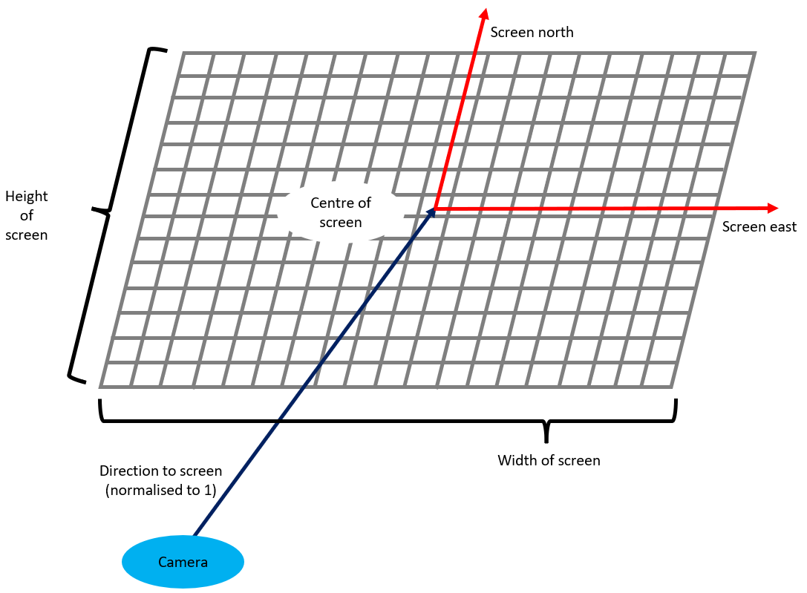

# Python Raytracing
## Introduction
A python implementation of ray tracing using the numba.cuda.jit wrapper for computation, therefore
any device running this project must have a cuda enabled graphics card.

### Requirements
- Cuda toolkit (tested on v11.3.1).
- Cuda enabled graphics card. 
- Packages in requirements.txt. Run `pip install -r requirements.txt` to install all.

The following are the images from the created scenarios. To see in more detail, visit the output_media directory.

### Scenario 3 images
https://github.com/jihoon3/python_raytracing/tree/main/output_media/Scenario3

 


### Scenario 7 images
https://github.com/jihoon3/python_raytracing/tree/main/output_media/Scenario7

 
 
 
 

### Scenario 8 images
https://github.com/jihoon3/python_raytracing/tree/main/output_media/Scenario8

 
 
 


## Demo
Run the demo.py script to render and display the scenario 7 images. The `render_scene_images` function 
(common to all scenarios) supports the parameters `show` (bool) and `save` (bool). If `show` is True, then
the rendered images are displayed using the Pillow library. If `save` is set to True, the rendered images
are saved to the appropriate directory in the _output_media_ directory.

# How to use
If you wish to try this yourself, you must understand the framework of the project. There are three main types of
classes:

1. SceneInterface - This is the main class that runs handling of objects to render as well as rendering the image.
2. Objects/MetaObjects - There are two subclasses Camera and Light. Camera is the class that sets the camera location,
viewing direction, angle, resolution e.t.c. Light is the class that sets the light location, shine e.t.c. ***Note***
only one instance of each Camera/Light classes are supported.
3. Objects/SolidObjects - There is one implementation of a "Solid Object" - the Sphere object. Instances of this class
contains information about the radius, position, colour e.t.c. of a single sphere instance.

The project uses the 
[Blinn-Phong shading model](https://en.wikipedia.org/wiki/Blinn%E2%80%93Phong_reflection_model) to render the images 
with an additional modelling of light intensity. In the Plinn-Phong shading model, the light source does not lose
intensity with distance to the object. In this implementation of the shading model, the light source has a parameter
called "intensity", `i`, and if the distance to the illuminated object is `d` say, then the illumination factor is 
determined by the formula:
```
d2 = d ** 2
illumination_factor = min(d2, i)/d2
```
Then, the Blinn-Phong calculated pixel rgb (on the 0-1 scale) value is multiplied by the illumination factor.


## Objects.SolidObjects.Sphere
```python
from Objects.SolidObjects import Sphere
import numpy as np

sphere1 = Sphere(
    name='sphere1',
    coordinates=np.array([0.5, -1.2, 4.12], dtype='float32'),
    ambient=np.array([0.3, 0.2, 0.1], dtype="float32"),
    diffuse=np.array([0.925, 0.678, 0.4], dtype="float32"),
    specular=np.array([1.0, 1.0, 1.0], dtype="float32"),
    shine=60,
    reflect=0.5,
    radius=1.2
)
```
**Arguments**:
- _name_ (str): The name of the sphere. Multiple objects may not share the same name.
- _coordinates_ (numpy array). A 3 dimensional float32 numpy array representing where the centre of the sphere is 
located
- _ambient_ (numpy array). 3 dimensional float32 numpy array (RGB) representing the **ambient** of the sphere according
to the [Blinn-Phong shading model](https://en.wikipedia.org/wiki/Blinn%E2%80%93Phong_reflection_model).
- _diffuse_ (numpy array). 3 dimensional float32 numpy array (RGB) representing the **diffuse** of the sphere according
to the [Blinn-Phong shading model](https://en.wikipedia.org/wiki/Blinn%E2%80%93Phong_reflection_model).
- _specular_ (numpy array). 3 dimensional float32 numpy array (RGB) representing the **specular** of the sphere according
to the [Blinn-Phong shading model](https://en.wikipedia.org/wiki/Blinn%E2%80%93Phong_reflection_model).
- _shine_ (int). An integer between 0 and 100 (incl.) representing the **shininess** of the sphere according to the 
[Blinn-Phong shading model](https://en.wikipedia.org/wiki/Blinn%E2%80%93Phong_reflection_model).
- _reflect_ (float). A float between 0 and 1 representing how reflective the sphere is. Reflective objects display 
objects reflected on its surface more clearly
- _radius_ (float). A positive float representing the radius of the sphere.

***Note*** the act of creating an instance of the sphere will automatically register it to the SceneInterface instance
(see the SceneInterface section below for more information). Moreover, if a sphere instance is edited (e.g. location
coordinates is changed either via reassignment or changing one coordinate axis) the change is automatically registered,
though this is not the case if the Sphere object has already been de-registered.

### Attributes

A sphere instance contains the same attributes (with the same definitions) as the input arguments.

### Methods

There are two methods, one instance method called _de_register_ and a class method, _create\_flat\_surface_.
```python7
Sphere.de_register(self):
```
This method de-registers the sphere object from scene. It is safe to modify the sphere after calling this method, 
but it will not be registered into scene automatically, but can be registered manually by using SceneInterface's 
_register_object_ method (see SceneInterface section).

```python7
import numpy as np
Sphere.create_flat_surface(
        cls,
        name: str,
        north: np.ndarray,
        east: np.ndarray,
        point_on_surface: np.ndarray,
        ambient: np.ndarray,
        diffuse: np.ndarray,
        specular: np.ndarray,
        radius: int = 100000,
        shine: int = 45,
        reflect: float = 0.1,
) -> 'Sphere':
```
This method provides an alternative way
of defining a sphere by specifying a tangential plane to the sphere. The tangent is defined by specifying the plane 
north, plane east and a point on the surface of the sphere. At the point of the sphere, once north and east are defined
the direction toward the centre of the sphere (orthogonal to both north and east) is determined using the 
left hand rule: north = index finger, east = thumb, direction to centre = middle finger.

Args:
- _name_ (str): The name of the sphere. Multiple objects may not share the same name.
- _north_ (numpy array). 3 dimensional float32 numpy array representing the north direction of the tangential plane
- _east_ (numpy array). 3 dimensional float32 numpy array representing the east direction of the tangential plane
- _point_on_surface_ (numpy array). 3 dimensional float32 numpy array representing the point on the surface of
the sphere with the tangent described by _north_ and _east_
- _ambient_ (numpy array). 3 dimensional float32 numpy array (RGB) representing the **ambient** of the sphere according
to the [Blinn-Phong shading model](https://en.wikipedia.org/wiki/Blinn%E2%80%93Phong_reflection_model).
- _diffuse_ (numpy array). 3 dimensional float32 numpy array (RGB) representing the **diffuse** of the sphere according
to the [Blinn-Phong shading model](https://en.wikipedia.org/wiki/Blinn%E2%80%93Phong_reflection_model).
- _specular_ (numpy array). 3 dimensional float32 numpy array (RGB) representing the **specular** of the sphere according
to the [Blinn-Phong shading model](https://en.wikipedia.org/wiki/Blinn%E2%80%93Phong_reflection_model).
- _shine_ (int). An integer between 0 and 100 (incl.) representing the **shininess** of the sphere according to the 
[Blinn-Phong shading model](https://en.wikipedia.org/wiki/Blinn%E2%80%93Phong_reflection_model).
- _reflect_ (float). A float between 0 and 1 representing how reflective the sphere is. Reflective objects display 
objects reflected on its surface more clearly
- _radius_ (float). A positive float representing the radius of the sphere.


## Objects.MetaObjects.Light
Only one light object is supported in this implementation of ray-tracing.

```python
from Objects.MetaObjects import Light
import numpy as np

light = Light(
    name='_light',
    coordinates=np.array([0.5, -1.2, 4.12], dtype='float32'),
    ambient=np.array([0.3, 0.2, 0.1], dtype="float32"),
    diffuse=np.array([0.925, 0.678, 0.4], dtype="float32"),
    specular=np.array([1.0, 1.0, 1.0], dtype="float32"),
    intensity=100
)
```
**Arguments**:
- _name_ (str): The name of the Light. Multiple objects may not share the same name. A light object must have
the name "_light". If not specified, the value "_light" is used as default.
- _coordinates_ (numpy array). A 3 dimensional float32 numpy array representing where the light is located.
- _ambient_ (numpy array). 3 dimensional float32 numpy array (RGB) representing the **ambient** of the light according
to the [Blinn-Phong shading model](https://en.wikipedia.org/wiki/Blinn%E2%80%93Phong_reflection_model).
- _diffuse_ (numpy array). 3 dimensional float32 numpy array (RGB) representing the **diffuse** of the light according
to the [Blinn-Phong shading model](https://en.wikipedia.org/wiki/Blinn%E2%80%93Phong_reflection_model).
- _specular_ (numpy array). 3 dimensional float32 numpy array (RGB) representing the **specular** of the light according
to the [Blinn-Phong shading model](https://en.wikipedia.org/wiki/Blinn%E2%80%93Phong_reflection_model).
- _intensity_ (int or float). The intensity constant of the light. This constant is used to calculate the illumination factor
which adjusts the Blinn-Phong calculated rgb pixel value. If the object lies within distance `intensity**0.5` of the light,
it is illuminated as per Blinn-Phong, but if it lies further away, it is illuminated less and less (inversely proportional
to the square of the distance).

***Note*** the act of creating an instance of a Light will automatically register it to the SceneInterface instance
(see the SceneInterface section below for more information). Moreover, if a light instance is edited (e.g. location
coordinates is changed either via reassignment or changing one coordinate axis) the change is automatically registered,
though this is not the case if the Light object has already been de-registered.

### Attributes

A Light instance contains the same attributes (with the same definitions) as the input arguments.

### Methods

There is only one method called _de_register_.
```python7
Light.de_register(self):
```
This method de-registers the light object from scene. It is safe to modify the light after calling this method, 
but it will not be registered into scene automatically, but can be registered manually by using SceneInterface's 
_register_object_ method (see SceneInterface section).

## Objects.MetaObjects.Camera
Only one camera object is supported in this implementation of ray-tracing.

**Theory**



The *camera* represents the observer's eyes and the *screen* represents the physical image that the ray-tracing 
produces. If there are objects behind the screen (not illustrated), then the ray-tracing algorithm calculates how 
those objects project onto the screen which creates the final image.

The three directional vectors representing (respectively) the direction from camera to centre of screen, screen north
and screen east must be orthogonal, thus only two of these vectors must be defined. For the *Camera* class, the
direction from camera to the centre and the screen north are required.


```python
from Objects.MetaObjects import Camera
import numpy as np

camera = Camera(
    name='_camera',
    coordinates=np.array([0.5, -1.2, 4.12], dtype='float32'),
    resolution=(1080, 1920),
    background_colour=np.array([0, 0, 0], dtype="float32"),
    screen_vectors=(
        np.array([0, 1, 0], dtype="float32"),
        np.array([0, 0, 1], dtype="float32"),
    )
)
```
**Arguments**:
- _name_ (str): The name of the Camera. Multiple objects may not share the same name. A camera object must have
the name "_camera". If not specified, the value "_camera" is used as default.
- _coordinates_ (numpy array). A 3 dimensional float32 numpy array representing where the camera is located.
- _resolution_ (pair of integers). Two integers (_x_, _y_), with _x_ representing the height and _y_ representing the #
width of the image (number of pixels).
- _background_colour_ (numpy array). 3 dimensional float32 numpy array (RGB) representing the background
colour of the image (this is the rgb value each pixel is initialised with).
- _screen_vectors_ (pair of numpy arrays). Two 3 dimensional float32 numpy arrays, _x_, _y_ where _x_ represents
the directional vector toward the *screen*, and _y_ is the directional vector representing the north direction
of the screen. Neither vectors must be normalised as the class will normalise it automatically.

***Note*** the act of creating an instance of a Camera will automatically register it to the SceneInterface instance
(see the SceneInterface section below for more information). Moreover, if a cemra instance is edited (e.g. location
coordinates is changed either via reassignment or changing one coordinate axis) the change is automatically registered,
though this is not the case if the Camera object has already been de-registered.

### Attributes

A Camera instance contains the same attributes (with the same definitions) as the input arguments.

### Methods

There is only one method called _de_register_.
```python7
Camera.de_register(self):
```
This method de-registers the camera object from scene. It is safe to modify the camera after calling this method, 
but it will not be registered into scene automatically, but can be registered manually by using SceneInterface's 
_register_object_ method (see SceneInterface section).


## SceneInterface.scene
This is the main object that handles the entire setup, and is an instance of 
SceneInterface._SceneInterface._SceneInterface.

The object has *dict-like* tendencies (see below), but also tracks every object created/registered, un-tracks 
de-registered objects, and an array of frames created

The *scene* object does not support retrieving or setting attributes 
(attempting to will result in a NotImplementedError) other than these three:

### Attributes
- _frames_ (np.ndarray): a numpy array of shape (_n_, _h_, _w_, 3) where _n_ is the number of frames, (_h_, _w_) is the
resolution of all frames taken during the lifetime of _scene_. ***Note*** _frames_ is None if no frames have been 
captured.
- _eps_ (float): A float value between 0 (excl.) and 0.1 (incl.) representing the _epsilon_ value. 
This is a hyper-parameter used to handle inaccuracies due to floating point precision issues.
- _reflect_ (int): An integer between 0 and 10 (incl.) representing the number of reflections in the ray-tracing
algorithm. Note the higher the number, the slower the performance.

_eps_ and _reflect_ each have a corresponding method to set a new updated value.

### Methods

Capture Frame:
```python
scene.capture_frame(self)
```
Runs ray-tracing and renders an image of the current configuration of objects and hyper-parameters. Can raise a 
SceneError if the entire scene is incorrectly set up. Current limitations are:
- Exactly 1 Camera object registered to _scene_.
- Exactly 1 Light object registered to _scene_.
- At least 1 Sphere object registered to _scene_.
- At most 511 Sphere objects registered to _scene_.

Setters:
```python
scene.set_reflect(self, reflect: int)
```
Sets the number of reflections for all subsequent frames (unless otherwise changed)

***Arguments:***
- _reflect_ (int): The number of reflections. Set it between 0 and 10 inclusive.

```python
scene.set_eps(self, eps: float)
```
Sets the epsilon value.

***Arguments:***
- _eps_ (float): The epsilon value. Must be between 0 (excl.) and 0.1 (incl.)

```python
from Objects import BaseObject
from typing import List

scene.register_object(self, object_item: BaseObject)
scene.register_objects(self, object_items: List[BaseObject])
```
Registers an _object_item_ or a list of _object_items_ to the _scene_ object. Can raise a 
ValueError if object_name already exists in _scene_, or a TypeError if the input object is not an instance
of a subclass of _BaseObject_.

***Arguments:***
- _object_item_ (BaseObject): The object to register. Note that objects are automatically registered when
initialised.
- _object_items_ (List\[BaseObject\]): A list of objects to register. Note that objects are automatically
registered when initialised. If you attempt to register multiple objects and there is an error, the
method attempts to rollback the other objects that had successfully registered during the method call.

```python
from typing import List

scene.de_register_object(self, object_name: str)
scene.de_register_objects(self, object_names: List[str])
```
De-registers an existing object or a list of existing objects in _scene_. Can raise a KeyError if the specified
name(s) do not exist in Scene.

***Arguments:***
- _object_name_ (str): The name of the object to de-register.
- _object_names_ (List\[str\]): A list of names to de-register. If you attempt to de-register multiple objects 
and there is an error, the method attempts to re-register the other objects that had successfully de-registered
during the method call.

Dict-like behaviour:

The _scene_ object keeps track of all objects created/un-tracks de-registered objects in a dict-like manner
and supports the following dict-like features:
- `__contains__`: supports the membership operator. e.g. `object_name in scene` returns `True` if there is an 
object currently registered to _scene_ with the name `object_name`
- `__getitem__`: supports indexed access to registered objects by object name. e.g. `scene[object_name]` returns
the object currently registered to _scene_ with the name `object_name`. Note that `__setitem__` is not supported,
so you must use the "de_register_object(s)"/"register_object(s)" methods.
- `scene.keys()`: Returns a `dict_keys` object containing the names of all objects currently registered
to _scene_.
- `scene.values()`: Returns a `dict_values` object containing all objects currently registered
to _scene_.
- `scene.items()`: Returns a `dict_items` object containing all name: object pairs currently registered
to _scene_.
